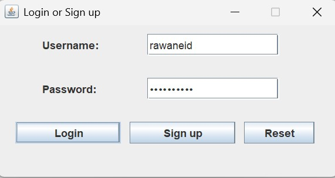
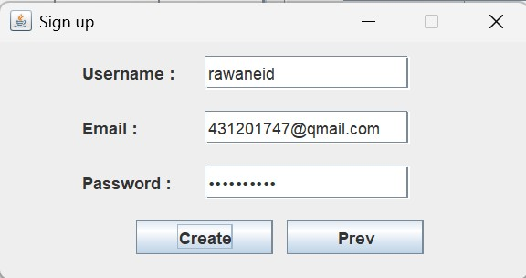
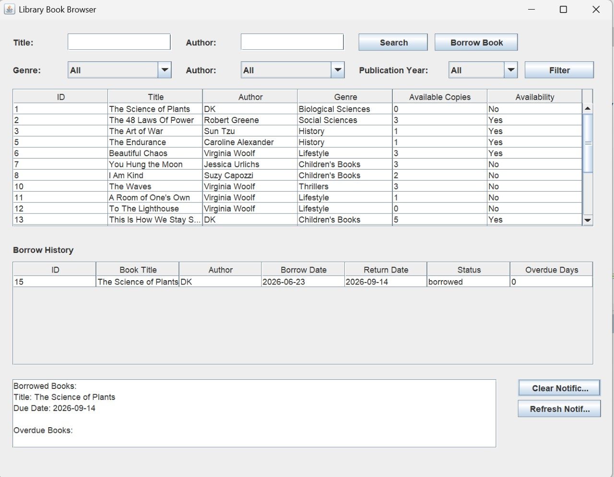
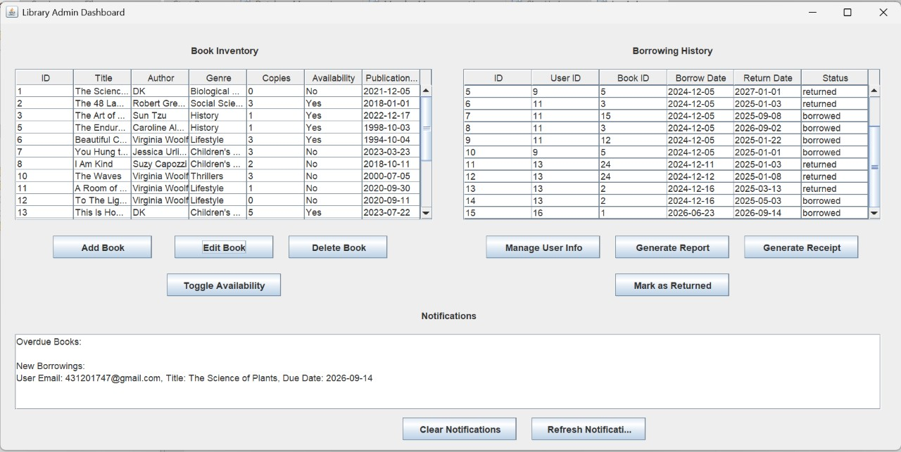
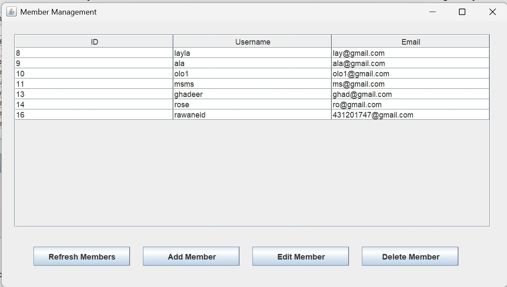
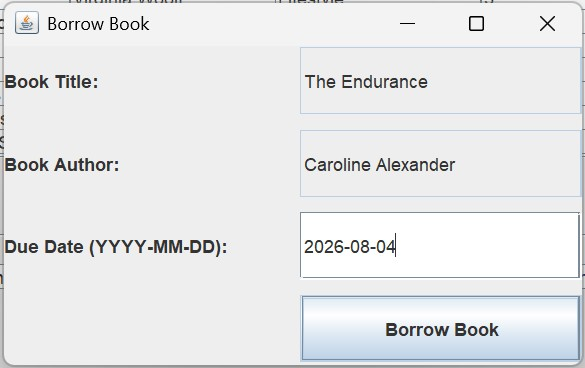
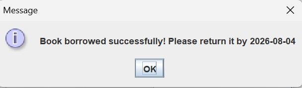

# Online Library Management System

A desktop-based Library Management System developed using Java Swing, MySQL, and JDBC.

## Features

- User Registration
- User Login
- Admin Dashboard
- Member Management
- Book Management
- Borrow Books
- Return Books
- Borrowing History
- Notifications
- Report Generation

## Technologies Used

- Java
- Java Swing
- MySQL
- JDBC
- Apache NetBeans

## Screenshots

### Login

### Sign Up

### User Dashboard

### Admin Dashboard

### Member Management

### Borrow Book

### Borrow Success

